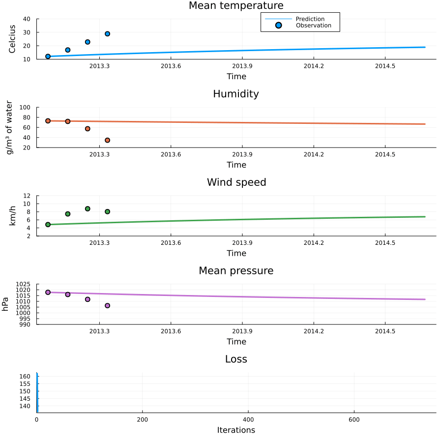
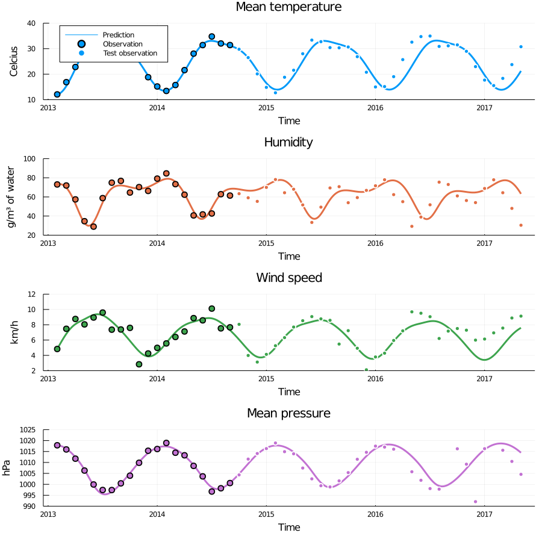

# Neural ODE weather forecasting
Companion repo to my blog article [Forecasting the weather with neural ODEs](https://sebastiancallh.github.io/post/neural-ode-weather-forecast/). Contains code for training the neural ODE and plotting the fit.

### Data
The dataset is [available on Kaggle](https://www.kaggle.com/sumanthvrao/daily-climate-time-series-data). It is not included in the repo to avoid potential issues with data redistribution. So you have to download and unzip the data set into the [data](./data) folder.

### Reproducing the experiments
Make sure you have Julia installed (tested with Julia 1.8). `cd` to the project root folder and run `julia --project` to enter the Julia shell using the project environment. Run `using Pkg; Pkg.instantiate()`, to pull down the dependencies, followed by `include("scripts/fit_model.jl")` to fit the model and generate the plots and animations seen in the blog article. Don't be surprised if creating the training animation takes at least as long as fitting the model.

### Figures
#### Model training animation

#### Model extrapolation

